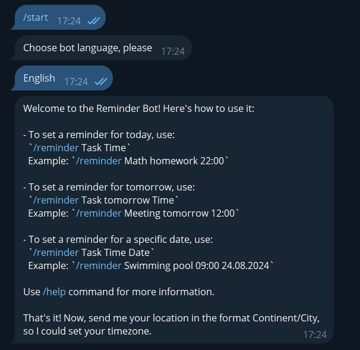

# Reminder Telegram Bot

## Getting Started
- Create a bot and obtain a token
- Install the aiogram and pytz libraries:

```
pip install aiogram
pip install pytz
```
  
- Create a config directory inside an app folder with a file named config.json and paste there the following:

  `{"tg_token": "specify_your_token_here"}`

- Run `python main.py` to start the bot

## How To Start Using The Bot

Send the **/start** command and follow instructions. After choosing bot language (English or Czech) and setting location, 
you can set your first reminder in an appropriate format. All acceptable formats are listed in a Welcome Message 
and available with a command **/help**.

<p align="center">
  
</p>


## How It All Works

Internally, the bot is structured to handle commands via the **aiogram library**, and reminders are stored in a dictionary where each user has their own list of tasks. When user sets a reminder, it is saved along with the time, and the bot schedules the reminder to be sent at the right time using asynchronous functions. The bot also handles delays and deletions of reminders via interactive buttons.


## Known Issues

The functions `delay_reminder` and `delete_reminder` do not currently operate as intended. When user receives a reminder and chooses to either postpone or delete it, the action is applied not to the specific reminder selected, but to the last reminder in the user's list of active reminders. 


## Future Improvements

One significant improvement would be transitioning from using a regular Python dictionary to a more efficient solution, such as a database (e.g., SQLite, PostgreSQL). Currently, the bot stores user languages, timezones, and scheduled reminders in a dictionary. However, using a database would offer several advantages, including persistent data storage, better handling of larger datasets, and the ability to perform complex queries or updates more efficiently. 

There are also many opportunities to enhance the bot's functionality. One potential feature is the implementation of regular reminders, such as "every September 1st."

Additionally, I plan to introduce the ability for users to manage their reminders before they are already sent. This would include options to delete or postpone reminders to different times and dates. These features could be conveniently accessed through inline buttons that would appear below the message listing all active reminders.
